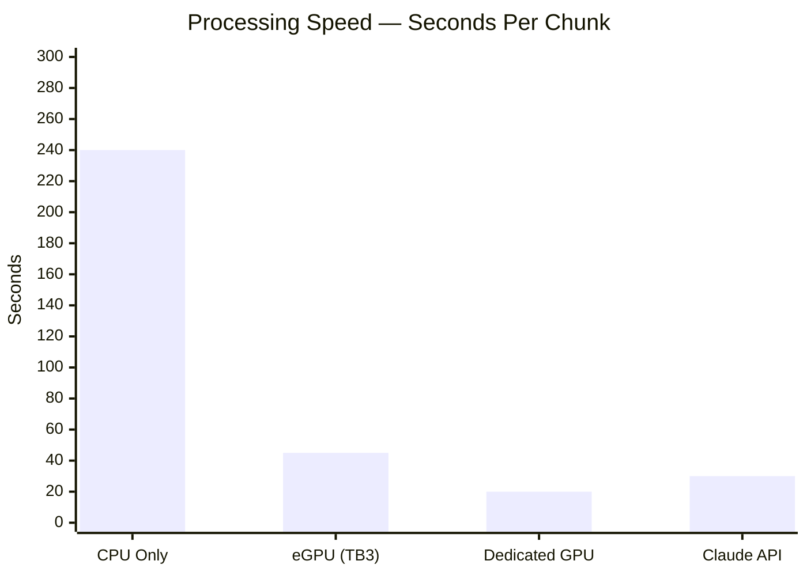
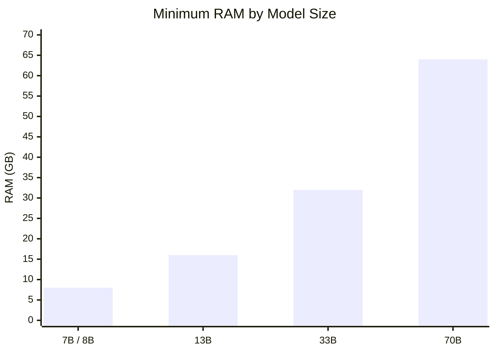

# NodeWeaver 🕸️

> AI-powered Obsidian graph optimizer. Drop a Markdown file in. Get a fully connected knowledge graph out.


NodeWeaver watches a folder. When you drop any `.md` file in, it sends the content to an AI model which intelligently restructures it into interconnected Obsidian nodes — complete with YAML frontmatter, tags, wikilinks, and navigation — ready for Obsidian's graph view.

---

## What It Does

**Before NodeWeaver** — a flat Markdown file, invisible in graph view:

```
my-notes.md   ← one big file, no connections
```

**After NodeWeaver** — a connected node network:

```
READY/
├── My Notes.md              ← hub (center of the graph)
├── Chapter 1 — Origin.md   ← node (linked to hub + siblings)
├── Chapter 2 — Build.md    ← node
└── Chapter 3 — The Cave.md ← node
```

Every node links back to the hub. Every node links to its siblings. Obsidian's graph view shows the full web automatically.

---

## Two Modes

### 🆓 Free Mode — Local AI (Ollama)
Runs entirely on your machine. No API key. No cost. No internet required.

- Uses **llama3.1** via Ollama
- Slower — depends on your hardware (CPU: ~3 min/chunk, GPU: much faster)
- Large files are automatically split into chunks and processed sequentially
- Private — your data never leaves your computer

### ⭐ Premium Mode — Claude API (Anthropic)
Runs in the cloud. Fast, high quality, costs ~$0.01–0.05 per file.

- Uses **claude-sonnet** via Anthropic API
- Fast — processes any file in under a minute
- Requires an Anthropic API key from console.anthropic.com
- Best for large files and production use

---

## Requirements

- Python 3.8+
- **Free:** Ollama installed with llama3.1 pulled
- **Premium:** Anthropic API key

---

## Setup

### Free Mode (Ollama)

**1. Install Ollama**
```bash
curl -fsSL https://ollama.com/install.sh | sh
```

**2. Pull llama3.1**
```bash
ollama pull llama3.1
```

**3. Install dependencies**
```bash
pip install ollama watchdog
```

**4. Run NodeWeaver**
```bash
python3 nodeweaver.py
```

---

### Premium Mode (Claude API)

**1. Install dependencies**
```bash
pip install anthropic watchdog
```

**2. Set your API key**
```bash
export ANTHROPIC_API_KEY="sk-ant-..."
```

To make it permanent:
```bash
echo 'export ANTHROPIC_API_KEY="sk-ant-..."' >> ~/.bashrc && source ~/.bashrc
```

**3. Swap the model in nodeweaver.py:**
```python
# replace the ollama import and call_ollama function with the Anthropic SDK
# see the Premium branch for the full implementation
```

**4. Run NodeWeaver**
```bash
python3 nodeweaver.py
```

---

## Usage

**Start NodeWeaver:**
```bash
python3 nodeweaver.py
```

**Drop any `.md` file into the `NodeWeaver/` folder.**

NodeWeaver will:

1. Detect the file automatically
2. Split large files into chunks if needed
3. Send each chunk to the AI model
4. Write optimized node files to `NodeWeaver/READY/`
5. Move your original to `NodeWeaver/PROCESSED/`

Then move the output files from `READY/` into your Obsidian vault.

---

## Folder Structure

```
NodeWeaver/
├── nodeweaver.py       ← the script
├── requirements.txt    ← dependencies
├── setup.sh            ← quick setup
├── READY/              ← output lands here (auto-created)
└── PROCESSED/          ← originals move here (auto-created)
```

---

## How the AI Decides the Structure

| Input | Output |
|-------|--------|
| Single focused concept (< 3 major sections) | One enhanced node with frontmatter + tags |
| Multi-section file (3+ major sections) | Hub node + individual nodes, all wired together |

Every output file gets:

- YAML frontmatter with relevant tags
- H1 title
- `[[Wikilinks]]` to connected files
- Hub / Prev / Next / Related navigation

---

## Hardware & Speed



| Hardware | Free Mode | Premium Mode |
|----------|-----------|--------------|
| CPU only (no GPU) | ~2–5 min / chunk | — |
| eGPU via Thunderbolt 3 | ~30–60 sec / chunk | — |
| Dedicated GPU (RTX 3080+) | ~15–30 sec / chunk | — |
| Claude API (cloud) | — | ~20–40 sec / file |

Large files are automatically chunked at 12,000 chars. A 200k char file = ~18 chunks.

---

## RAM Requirements (Free Mode)



| Model | RAM Required | Notes |
|-------|-------------|-------|
| llama3.1 (8B) | 8 GB | Default — runs on most machines |
| 13B models | 16 GB | Better quality, slower |
| 33B models | 32 GB | High quality, needs beefy hardware |
| 70B models | 64 GB | Near-GPT4 quality, workstation only |

> NodeWeaver defaults to **llama3.1 (8B)**. To use a larger model, change `MODEL` in `nodeweaver.py` and pull it with `ollama pull <model>`.

---

## License

MIT — use it, fork it, build on it.
